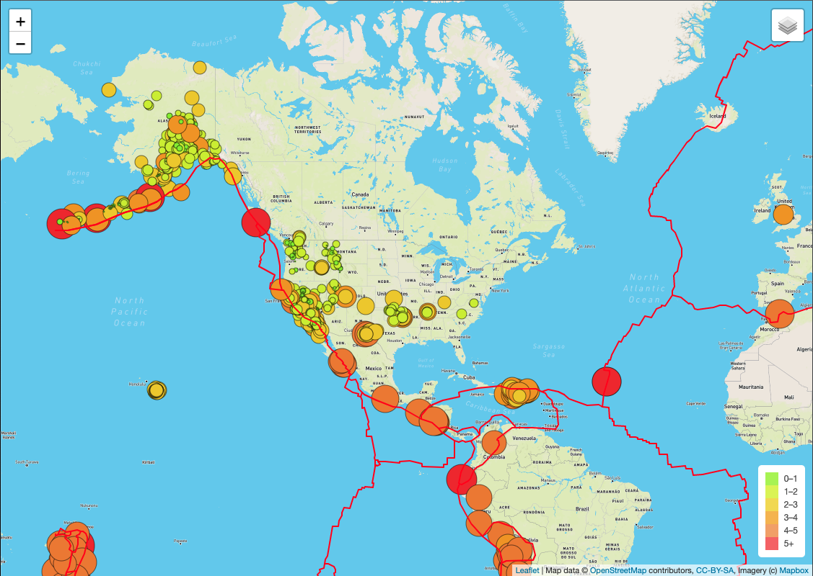
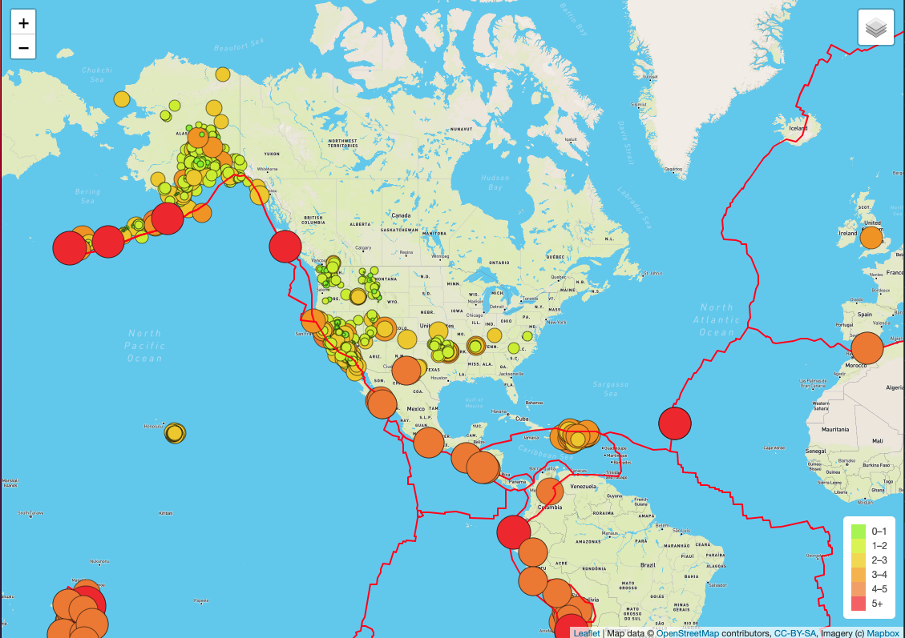
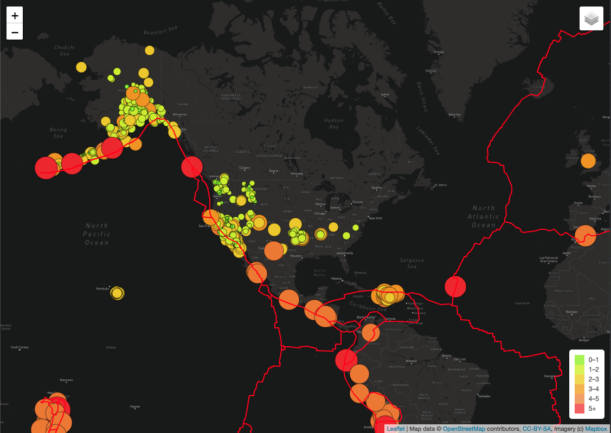

# Mapping_Earthquakes

# Overview

The purpose of this project was to use tools such as `Leaflet.js` library, `Javascript` and `HTML`  to visually show the magnitudes of earthquakes around the world for the past 7 days. `GeoJSON` data was used which was retrieved from [USGS website](https://earthquake.usgs.gov/earthquakes/feed/v1.0/geojson.php). The data was expored on the map to include tile layers and the ability to toggle between the data products presents:
* Tectonic Plates
* Earthquakes and
* Major Earthquakes.

The map tile layers included Street view, satelite view and dark view.

Examples are displayed below:

* Map shows the tectonic plates.

* Map shows the major eathquakes 

* Dark map view
